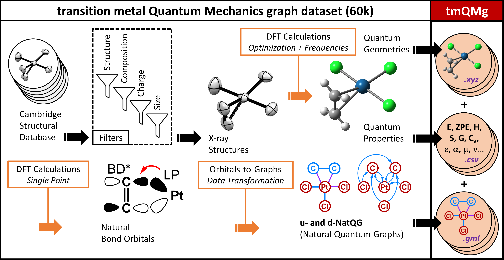

## Data

This repository contains the graph dataset tmQMg containing descriptive graph representations of 60,799 transition metal complexes (TMCs), including all thirty elements from the 3d, 4d, and 5d series. These representations were derived from quantum chemistry simulation data and more preciseley Natural Bond Order (NBO) analysis. We provide three different types of graphs as GML formatted files: baseline, u-NatQG and d-NatQG. The graphs can be used in deep graph learning methods and can be downloaded from [here](https://archive.norstore.no/pages/public/datasetDetail.jsf?id=10.11582/2022.00042). The code used to generate these representations can be found at [HyDGL](https://github.com/hkneiding/HyDGL). A detailed discussion about the representations and machine learning methods can be found in the corresponding [publication](https://chemrxiv.org/engage/chemrxiv/article-details/62b8daaf7da6ce76b221a831).

###### [data/tmQMg_properties_and_targets.csv](data/tmQMg_properties_and_targets.csv)
- List of all 60,799 TMCs and their respective graph level features and quantum properties.
- graph level features are: charge, molecular mass, number of atoms and number of electrons

###### [data/tmQMg_xyz.zip ](data/tmQMg_xyz.zip)
- Zip file of the xyz data of all compounds in the dataset.

###### [data/outliers.txt](data/outliers.txt)
- List of the IDs of about 2,5k of the TMCs that were deemed to be outliers based on their quantum properties.

## Code

Furthermore, we provide here the Python codes used to perform the various machine learning experiments.  
###### [scripts/Gilmer-MPNN/](scripts/Gilmer-MPNN/)
- holds the code for the Gilmer net and comprehensive analysis of data
- consult the provided README for more info
---

[![CC BY NC 4.0][cc-by-nc-image]][cc-by-nc]

This work is licensed under a
[Creative Commons Attribution-NonCommercial 4.0 International License][cc-by-nc].

[cc-by-nc]: http://creativecommons.org/licenses/by-nc/4.0/
[cc-by-nc-image]: https://i.creativecommons.org/l/by-nc/4.0/88x31.png
